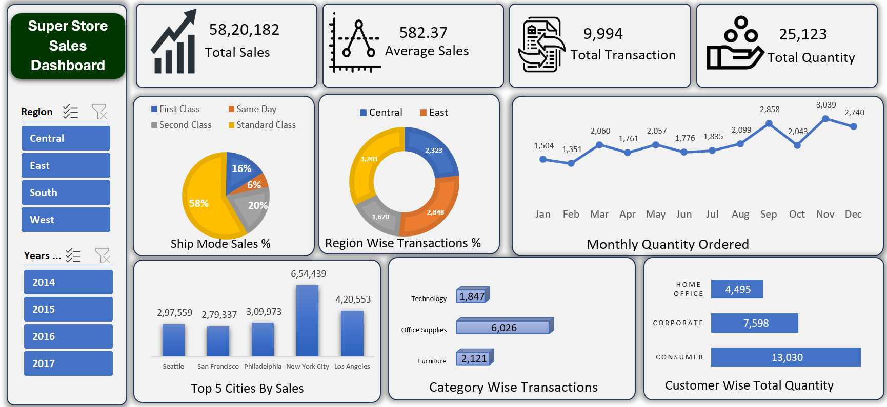

# 📊 Super Store Sales Dashboard  

This repository contains an **Excel-based Sales Dashboard** that provides a complete overview of **Super Store sales performance** across regions, categories, and customer segments.  

## 🚀 Features  
- **Total Sales Overview** – ₹58,20,182 total sales with average sales of ₹582.37  
- **Total Transactions & Quantity** – 9,994 transactions and 25,123 quantities ordered  
- **Region Wise Analysis** – Sales performance segmented by Central, East, South, and West regions  
- **Ship Mode Performance** – Standard Class, Second Class, First Class, and Same Day  
- **Monthly Trend** – Month-wise quantity ordered throughout the year  
- **Top 5 Cities by Sales** – New York City, Los Angeles, Philadelphia, Seattle, San Francisco  
- **Category Wise Transactions** – Technology, Office Supplies, and Furniture  
- **Customer Segment Analysis** – Consumer, Corporate, and Home Office  

## 📷 Dashboard Preview  
  

## 📂 Files Included  
 Excel_endtoend_dashboard.png 
 Superstore Data.xlsx

## 📊 Insights from Dashboard  
- **New York City** generated the highest sales (₹6,54,439).  
- **Standard Class shipping** contributed the largest share (58%).  
- **Consumers** are the top customer segment with 13,030 total quantity.  
- **Office Supplies** is the most transacted category with 6,026 orders.  
- Sales peak in **November** with 3,039 quantities ordered.  

## 🛠 Tools Used  
- **Microsoft Excel** (Data Cleaning, Pivot Tables, Charts, Dashboarding)  

## 🤝 Contribution  
Feel free to fork this repo, raise issues, or contribute by adding more analytics dashboards.  

## 📬 Contact  
For any queries or collaboration, reach out via [LinkedIn]((https://www.linkedin.com/in/devendra-pratap-singh-solanki-05b9932a7/)).  

